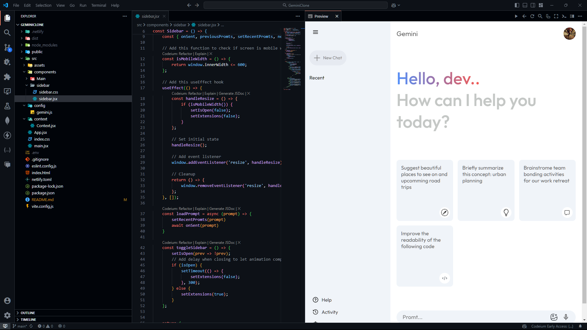
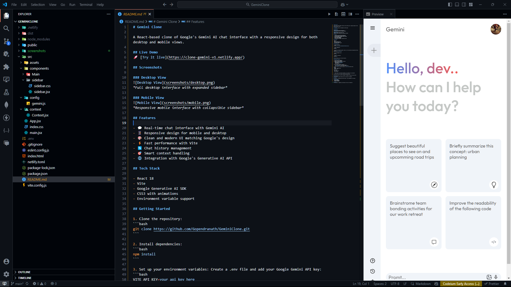

# Gemini Clone

'A React-based clone of Google's Gemini AI chat interface with a responsive design for both desktop and mobile views.'

## Live Demo
🚀 [Try it live](https://clone-gemini-v1.netlify.app/)

## Screenshots

### Desktop View

*Full desktop interface with expanded sidebar*

### Mobile View

*Responsive mobile interface with collapsible sidebar*

## Features

- 💬 Real-time chat interface with Gemini AI
- 📱 Responsive design for mobile and desktop
- 🎨 Clean and modern UI matching Google's design
- ⚡ Fast performance with Vite
- 🔄 Chat history management
- 🎯 Smart context handling
- 🌐 Integration with Google's Generative AI API

## Tech Stack

- React 18
- Vite
- Google Generative AI SDK
- CSS3 with animations
- Environment variable support

## Getting Started

1. Clone the repository:
```bash
git clone https://github.com/Gopendranath/GeminiClone.git
```

2. Install dependencies:
```bash
npm install
```

3. Set up your environment variables: Create a .env file and add your Google Gemini API key:
```bash
VITE_API_KEY=your_api_key_here
```

4. Run the development server:
```bash
npm run dev
```

5. Building for Production
```bash
npm run build
```

The build output will be in the dist directory.

## Deploying to Netlify

1. Fork and clone the repository
2. Create a new site in Netlify
3. Connect your GitHub repository to Netlify
4. Configure the build settings:
   - Build command: `npm run build`
   - Publish directory: `dist`
   - Base directory: `/`

5. Add environment variables in Netlify:
   - Go to Site Settings > Environment variables
   - Add `VITE_API_KEY` with your Google Gemini API key

6. Deploy settings are already configured in [netlify.toml](netlify.toml):
```toml
[build]
  command = "npm run build"
  publish = "dist"

[[redirects]]
  from = "/*"
  to = "/index.html"
  status = 200
```

7. Trigger deploy from the Netlify dashboard or push changes to your repository

Your site will be live at https://your-site-name.netlify.app

Note: Make sure your .env file is included in .gitignore to keep your API key secure.

## Contributing
Contributions are welcome! Please feel free to submit a Pull Request.

## License
This project is licensed under the MIT License - see the LICENSE file for details.

## Acknowledgments
- Google's Gemini AI
- Vite React Template
- The React Community

## Contact
For any queries or suggestions, please open an issue in the repository.